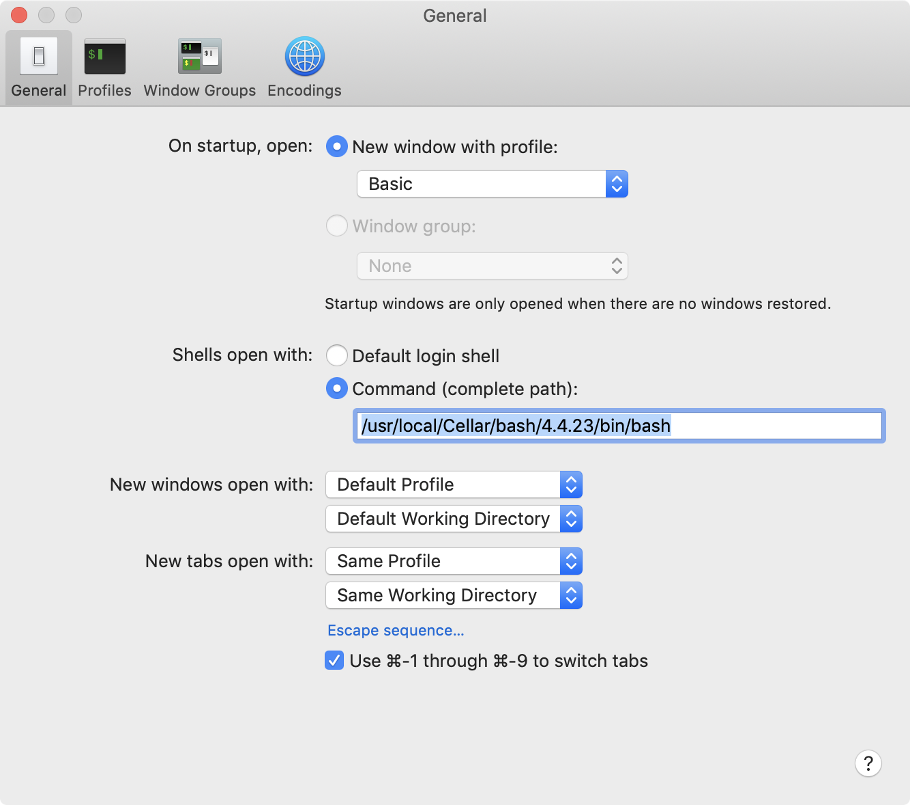

# vopt.conda

## Description

`vopt.conda` repository provides the scripts to install
a conda virtual enviroment named `vopt` for `vopt` Veranos Optimizer

`vopt` virtual enviroment consist of:

* Python 3.6 and other python packages
* for package tree, read [`deptree.txt`](deptree.txt) and [`deptree_rev.txt`](deptree_rev.txt). (generated by pipdeptree)


## Prerequisite

* OS

  * Ubuntu 16.04
  * Mac OS X

* You need to install Anaconda.

  Download 64-bit Python 3.6 version from
    * https://www.continuum.io/downloads

  and execute:
  ```
  $ bash Anaconda3-5.1.0-Linux-x86_64.sh
  ```

* You need to upgrade bash to 4.2 or newer version

  * see https://apple.stackexchange.com/questions/193411/update-bash-to-version-4-0-on-osx


## Installation


1. `$ source install_lib.sh` : install linux libraries
1. `$ source create_env.sh` : create virtual environment
1. `$ source install_pkg.sh` : install Python packages


## Using Environment

* activate the environment.
  ```
  $ source activate vopt
  ```

* deactivate the environment.
  ```
  $ source deactivate
  ```

## Uninstallation

```
$ source delete_env.sh
```

## Using Docker Image with Pre-Installed Enviroment

1. (Optionally on Mac/Windows) Install Docker-Toolbox, Docker for Mac or Docker for Windows
1. (Optionally on Mac/Windows) Start a docker machine using Docker QuickStart Terminal
1. Download a docker image from dockerhub
   ```
   $ docker pull veranostech/vopt
   ```

   or you can build the docker image on you computer.

   For details, read https://github.com/VeranosTech/vopt.docker

1. Run the docker image
   ```
   $ docker run --name vopt --rm -Pit -p 8222:22 veranostech/vopt
   ```


# Trouble Shootings

## Bash Version Problem

### Error Messages

If you meet the error message,
```
conditional binary operator expected
```

check you bash version and upgrade to 4.x.

### Bash Upgrade in Mac OSX

1. install brew

   * https://brew.sh/

2. upgrade bash:

   ```
   brew install bash
   ```

3. Change the default shell

   
